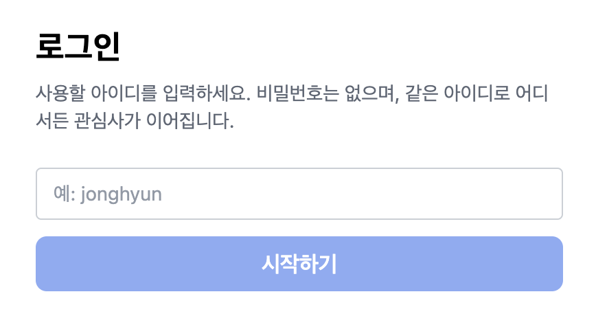
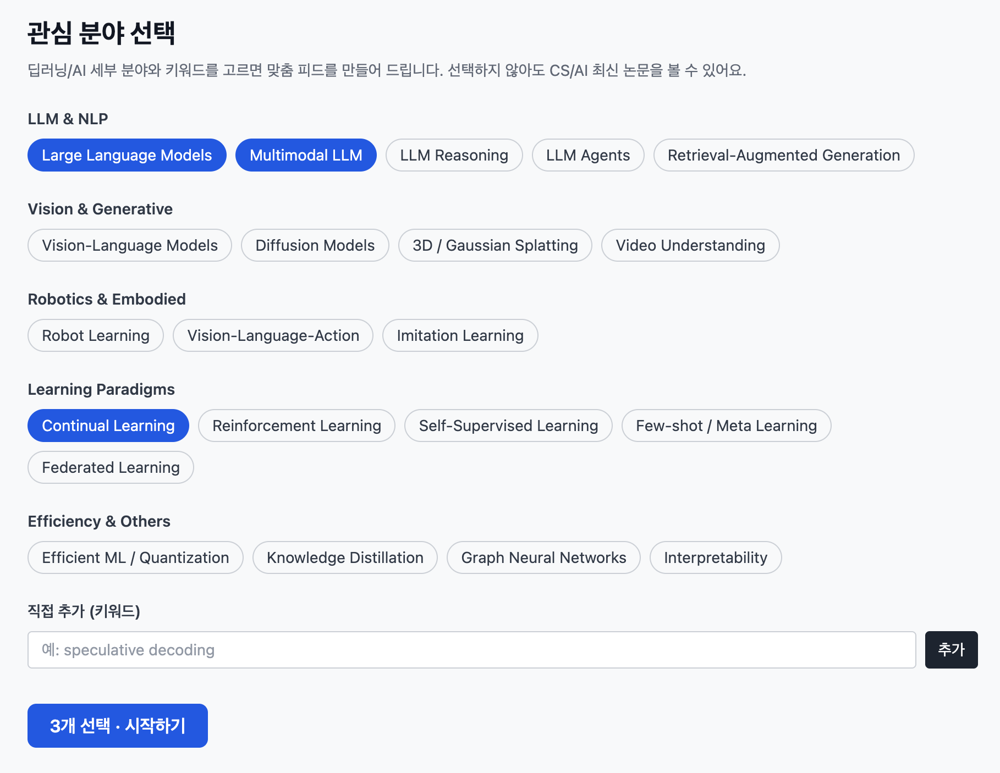
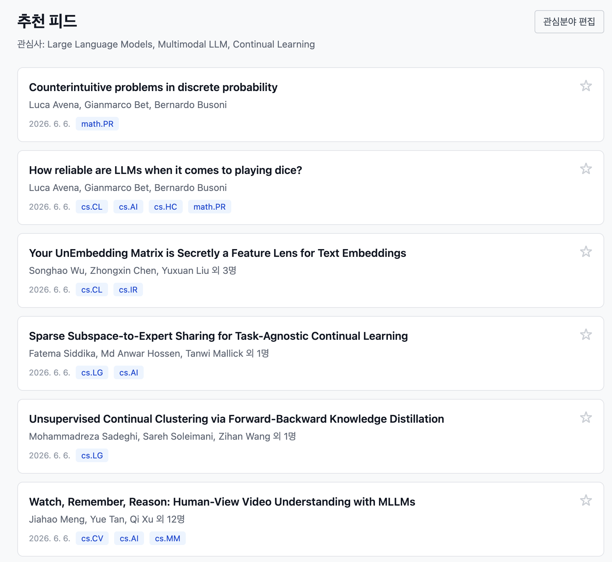
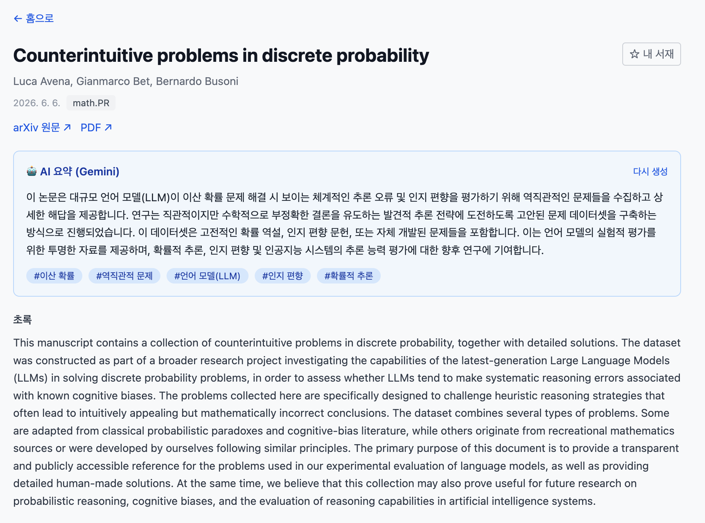
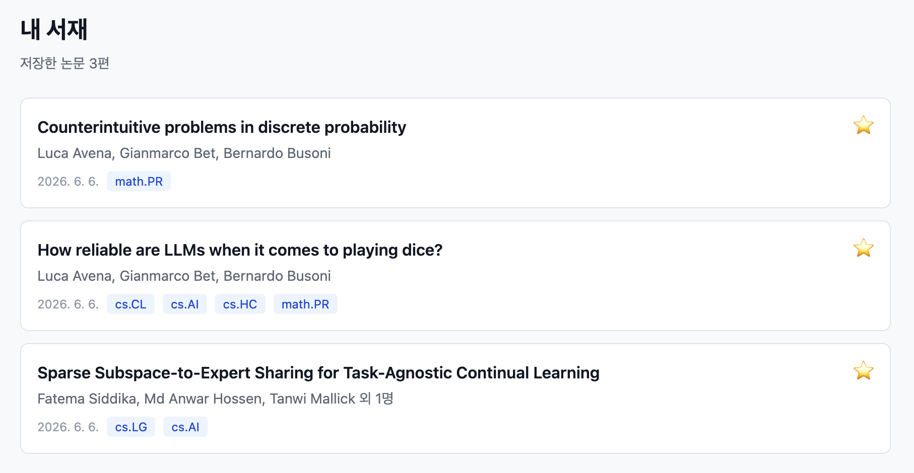
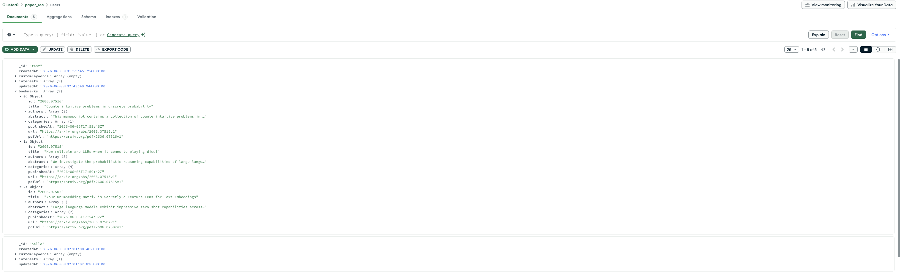
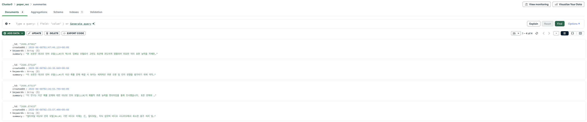
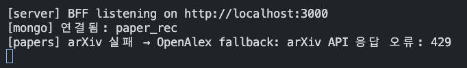

# 2주차 구현 정리 — 사용자 맞춤형 논문 추천 서비스

> CS/AI 연구자를 위한 **관심사 기반 논문 추천 + LLM 요약** 웹 서비스.

---

## 요약

사용자는 **관심 분야를 고르면**, 그에 맞는 **arXiv 최신 논문**을 피드로 받고,
각 논문을 **AI(Gemini)가 한국어로 요약**해 주며, 마음에 드는 논문은 **내 서재에 저장**한다.
모든 개인 데이터(관심사·북마크·요약)는 **MongoDB에 저장**된다.

```
[로그인] → [관심분야 선택] → [홈 추천 피드] → [논문 상세 + AI 요약] → [내 서재 저장]
                                    ↑ arXiv (실패 시 OpenAlex 자동 전환)
                         개인 데이터는 모두 MongoDB에 영속
```

### 시스템 구성

```
[ 브라우저 / React SPA ]            ← 화면, 로그인, 상태
        │  /api/*
        ▼
[ 서버 (BFF, Hono) ]               ← 외부 API 프록시 + API 키 은닉
   ├── arXiv / OpenAlex            ← 논문 검색·메타데이터
   ├── Google Gemini              ← 논문 요약
   └── MongoDB (Atlas)            ← 관심사·북마크·요약 영구 저장
```

---

## 이번 주 구현 기능

### 1. 간단 로그인

사용자가 **아이디만 입력**하면 그 아이디로 식별된다(비밀번호 없음).
같은 아이디로 어느 브라우저/기기에서 접속해도 **내 관심사·북마크가 그대로** 이어진다.

- 입력한 `userId`가 모든 개인 데이터(MongoDB)의 키가 된다.
- 로그인 안 한 상태면 자동으로 로그인 화면으로 보낸다.

<!-- 구현 이미지 -->


---

### 2. 관심분야 선택 (온보딩)

첫 방문 시 **딥러닝/AI 세부 분야**를 칩으로 고른다.
(예: Multimodal LLM, Continual Learning, Robot Learning, Vision-Language-Action, Diffusion Models …)
직접 **커스텀 키워드**도 추가할 수 있다.

- 선택한 관심사는 **MongoDB에 저장** → 다음에 로그인해도 유지.
- 이 관심사가 홈 추천 피드의 검색 조건이 된다.

<!-- 구현 이미지 -->


---

### 3. 홈 추천 피드

선택한 관심사에 맞는 **arXiv 최신 논문**을 카드 목록으로 보여준다.

- 여러 관심사는 OR로 묶어 "하나라도 맞으면" 노출 (최신순).
- 각 카드: 제목·저자·발행일·카테고리 태그·북마크 버튼.
- 관심사가 없으면 CS/AI 최신 논문으로 fallback.

<!-- 구현 이미지 -->


---

### 4. 논문 상세 + LLM 요약

논문을 클릭하면 **제목·저자·초록·원문/PDF 링크**와 함께,
**Gemini가 생성한 한국어 3~4문장 요약 + 핵심 키워드**를 보여준다.

- 요약은 한 번 만들면 **MongoDB에 캐시** → 다음엔 즉시 표시(중복 호출/비용 방지).
- Gemini API 키는 **서버에만** 두어 노출되지 않는다.

<!-- 구현 이미지 -->


---

### 5. 내 서재 (북마크)

논문 카드/상세의 **☆ 버튼**으로 관심 논문을 저장한다. 내 서재 탭에서 모아 보고 제거할 수 있다.

- 북마크도 **MongoDB에 저장(userId 기준)** → 다른 기기에서도 동일하게 보인다.

<!-- 구현 이미지 -->


---

## 백엔드 · 인프라

### MongoDB (개인 데이터 영구 저장)

관심사·북마크·요약을 **MongoDB(Atlas)** 에 저장한다. 서버를 재시작해도 데이터가 유지되고,
같은 아이디면 기기 간에 동기화된다.

| 컬렉션 | 내용 |
|--------|------|
| `users` | `{ _id: userId, interests[], customKeywords[], bookmarks[] }` — 관심사 + 북마크 |
| `summaries` | `{ _id: arxivId, summary, keywords[] }` — 논문 요약 캐시 |




### arXiv → OpenAlex 자동 fallback

arXiv API는 호출이 몰리면 **429(레이트 리밋)** 로 막힌다. 이때 피드/상세가 끊기지 않도록
**OpenAlex로 자동 전환**한다.

- arXiv 우선 호출(User-Agent + 짧은 재시도) → 실패 시 OpenAlex.
- OpenAlex도 **arXiv 논문만** 골라 ID·초록을 동일하게 맞춰, 상세/요약이 그대로 동작.

<!-- 구현 이미지 (선택) -->


---

## 기술 스택

| 영역 | 스택 |
|------|------|
| 프론트엔드 | Vite · React · TypeScript · React Router · TanStack Query · Zustand · Tailwind CSS |
| 백엔드(BFF) | Hono (Node) |
| 데이터베이스 | MongoDB (Atlas) |
| 외부 API | arXiv, OpenAlex(대체), Google Gemini |

## 개발 관리

- 브랜치 전략 `main ← dev ← feature/*`, 기능별 PR
- 개발 task는 GitHub Issues, 기획/문서는 Wiki로 관리
- 자세한 규칙: [README](../README.md) · [CONTRIBUTING](../CONTRIBUTING.md)
